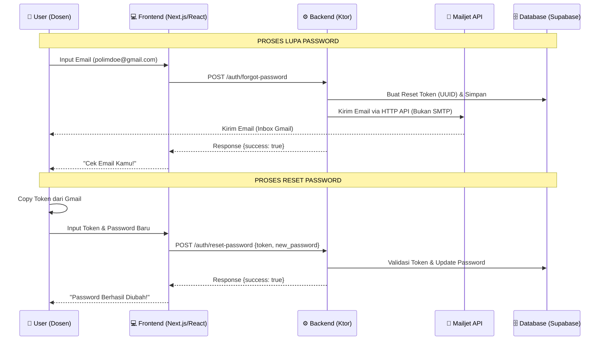

# 🧭 GAMBARAN ALUR RESET PASSWORD (MAILJET ENGINE)

Dokumen ini menjelaskan alur teknis pengiriman email reset password menggunakan Mailjet API di backend Ktor.

## 🏗️ Arsitektur Alur

## 🔑 Key Configuration (Production)
Untuk memastikan sistem ini jalan di server (Railway), pastikan variabel berikut sudah terpasang:

| Variable | Value |
|---|---|
| `MAILJET_API_KEY` | `3dabba37ee14469b987c3ae90e931ef1` |
| `MAILJET_SECRET_KEY` | `2f3fe3fa4b860eba7ce0c1410716cced` |

## 🧪 Cara Testing di Postman
1. **Endpoint Forgot**: Tembak email kamu.
2. **Cek Gmail**: Buka email dari "Sistem Akademik Kampus".
3. **Endpoint Reset**: Masukkan token dari email dan buat password baru.
4. **Login**: Coba login pake password baru. **BOOM! Berhasil.**
